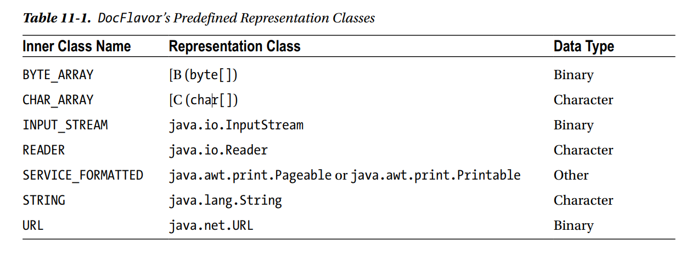
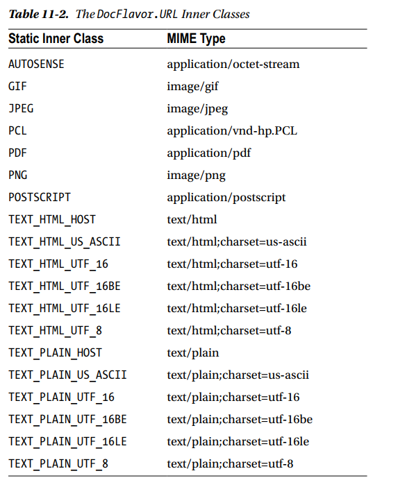
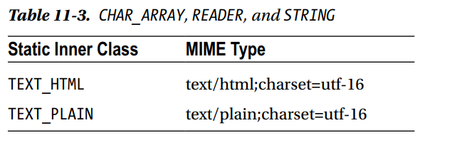

## Java printing 4 steps

1. Locate print services (printers), optionally limiting the list of those returned to the ones that support the capabilities your application needs. 
- Print services are  represented as instances of `PrintService` implementations.  

2. Create a print job by calling the `createPrintJob()` method defined in the `PrintService` interface. The print job is represented by an instance of  `DocPrintJob`.  

- `DocPrintJob.createPrintJob(PrintService interface)`

3. Create an implementation of the Doc interface that describes the data you want to print. You also have the option of creating an instance of  `PrintRequestAttributeSet` that describes the printing options you want.  

- the data you want to print
-  the printing options you want

4. Initiate printing by calling the `print()` method defined in the `DocPrintJob` interface, specifying the Doc you created in the previous step and the  `PrintRequestAttributeSet` or a null value.


---

## Locating Print Services

You locate a printer using one of three **static** methods defined in the `PrintServiceLookup` class. The simplest  
of the three methods is `lookupDefaultPrintService()`, and as its name implies, it returns a reference to the  
service that represents your default printer.

- 找出 default printer
```java
PrintService service =  PrintServiceLookup.lookupDefaultPrintService();
```


- In practice, you’ll typically want  
to select only those printers that are able to handle the type of data you want to print and that support  
the features your application needs, such as color or two-sided printing

- 選顏色, 雙面該要怎麼辦?
	- 有 2 個 static method, 一個是` lookupPrintServices()`, 另外一個是 `lookupMultiDocPrintServices()`

- `lookupPrintServices(parameter1,parameter2)`
	- `parameter1` : an instance of `DocFlavor` 
	- `parameter2` : an instance of some implementation of the `AttributeSet` interface
	- can specify `null` to both `parameter1` and `parameter2`
	- return `PrintService`, in which printers that is available
	- get the name of the printer : use `getName()`


---

## DocFlavor

- describes the type of data to be printed

- how that data is stored

-  won’t be necessary for you to create a new instance of `DocFlavor`

- `DocFlavor` instance **encapsulates both a representation class and a MIME type** 
that identifies the type of data to be printed


- `DocFlavor` constructor

- `DocFlavor(String mimeType, String className)`

	- `mimeType` : The type of data to be printed
		- gif file : `image/gif`
		- txt file : `text/html`

---

### Representation Class

- how that data is to be made available to the print service

- aside from *SERVICE_FORMATTED*, each one is described as being associated with 
either **binary** or **character** data.

> However, the distinction is important
because character-oriented representation classes aren’t appropriate for storing the binary data that’s
to be printed. For example, you wouldn’t store a representation of a GIF image in a character array or a
String, and you wouldn’t make it accessible through a Reader implementation. On the other hand, because
“character” data is just a specialized type of binary data, it’s entirely appropriate to store text information in a
byte array or make it accessible through an InputStream or via a URL.



```java
DocFlavor flavor = DocFlavor.URL.GIF;
```

- This code creates a reference to the static instance of `DocFlavor` that has a representation class of
`java.net.URL` and a `MIME type` of `image/gif`.

- All of the classes in `11-2` are in `DocFlavor.URL` class



```java
DocFlavor flavor = DocFlavor.BYTE_ARRAY.GIF;
```

- if you had loaded the GIF data into a byte array



```java
DocFlavor flavor = DocFlavor.STRING.TEXT_PLAIN;
```

- you wanted to print plain-text data that’s stored in an instance of String


```java
DocFlavor flavor = DocFlavor.STRING.TEXT_HTML;
```

- if the text data represented an HTML document and you wanted to have the data printed as it
would appear within a web browser


- To summarize, the DocFlavor encapsulates the following two pieces of information:

	- Where the data is located/how it's accessed, such as via a URL, a byte array, or a
String instance.

	- The type of thing the data represents, such as a GIF image, plain text, or an HTML
document


---

## Choosing the Right Printer

- `lookupPrintServices()` allows you to
specify a `DocFlavor` as its first argument, and if you specify a non-null value, the method will return only the
`PrintService` instances that correspond to printers that support the specified `DocFlavor`.

> lookupDefaultPrintService 第一個參數是可以看你傳過去的檔案是不是跟印表機有對到,
如果沒有就會有 exception

```java
// get the printer that supports the gif images that are referenced via URL
DocFlavor flavor = DocFlavor.URL.GIF;
PrintService[] services = PrintServiceLookup.lookupPrintServices(flavor, null);
```

- retrieve an array that identifies all printers on your system that can print GIF images that
are referenced via a URL


- if your application has already retrieved a reference to a `PrintService` and you want to
determine whether it supports a particular flavor, you can call the `isDocFlavorSupported()` method

> 如果沒有做前置處理, 就要用 isDocFlavorSupported 判斷是不是有 support

---

## AttributeSet

- your application may also need to select a printer based
upon the features that the printer supports

> For example, if you’re printing a graph that uses different colors to
convey information, you might want to see if a given service supports color printing and, if not, either prevent
the printer from being used or render a representation of the graph that doesn’t rely on colors.

- Characteristics
	- print in color
	- print on both sides of a page
	- use a different orientation (portrait or landscape) 

- `javax.print.attribute`
	- interface : `AttributeSet`
		-  the second parameter that can be specified on a call to `lookupPrintServices()`

> if you specify both a `DocFlavor` and an `AttributeSet` on a call to `lookupPrintServices()`, 
the method will return only those printers that support both the specified flavor and the appropriate attributes.


---

## Attribute

- `javax.print.attribute`
	- interface `Attribute`

> you create the collection of attributes by adding instances of Attribute to an `AttributeSet` by calling the add() method


---

## Attribute Roles

- attributes are used in various places within the Java print service
and not every attribute is valid within every context

- `OrientationRequested` and `ColorSupported`

> `OrientationRequested` is an
attribute you use to pass information to the print service, and ColorSupported is one that the print service
uses to provide you with information about the printer’s abilities. You can’t specify ColorSupported as
an attribute when creating a document to be printed because the printer’s ability to print in color isn’t
something your application is able to control.

> 如果是 OrientationRequested, 自己想要 protrait 或者是其他的可以自己選, 所以是給 value
給 printer, 但是如果是 `ColorSupported`, 印表機可能只有黑白的 , 所以就無法選擇, 這變成就是由印表機控制的 attribute


---

## Interfaces and Implementations
